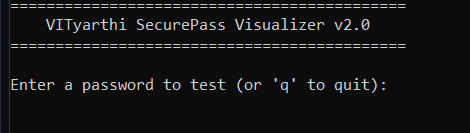
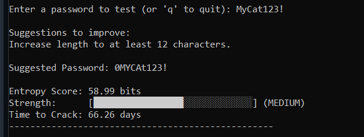
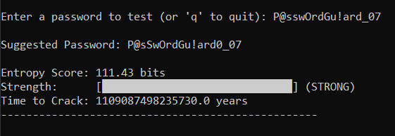
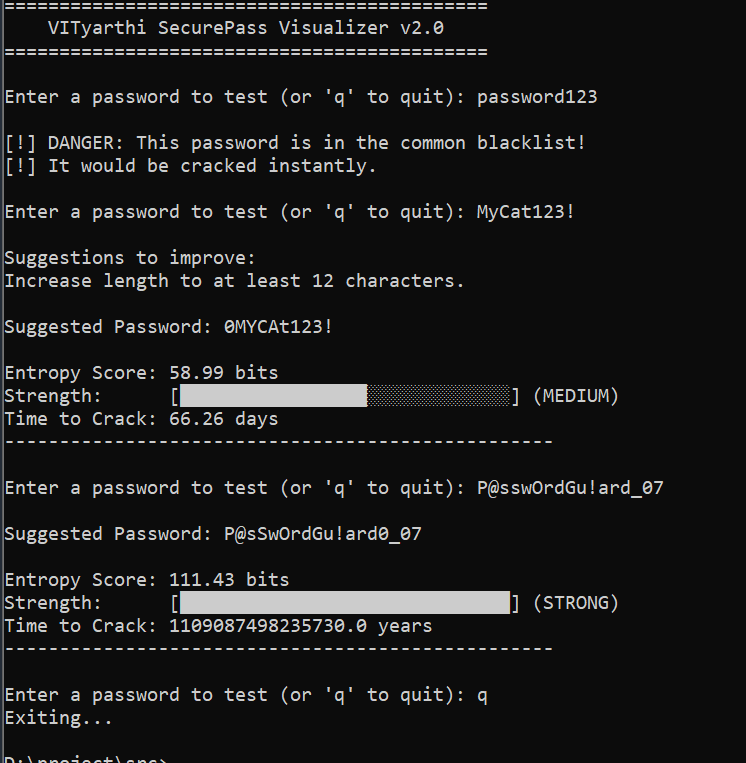

# 🔐 VITyarthi SecurePass Visualizer

## 📝 Overview

The *VITyarthi SecurePass Visualizer* is a Python command-line utility designed to help users assess the strength and security of their passwords. It calculates a password's *entropy score* (measured in bits), provides a visual strength bar, estimates the time a modern attacker would take to crack the password, and checks it against a list of common, blacklisted passwords. The tool offers actionable feedback and an automated suggestion for improving a weak password.

---

## ✨ Features

* *Entropy Calculation:* Calculates the cryptographic entropy of the password using the pool size (character set) and length, providing a quantified measure of strength.
* *Visual Strength Bar:* Displays a clear, graphical representation of the password strength (WEAK, MEDIUM, or STRONG).
* *Cracking Time Estimation:* Provides a clear estimate of the time required to crack the password, based on a massive guessing rate (100 billion guesses per second).
* *Blacklist Check:* Validates the password against a pre-defined list of common, easily guessed passwords.
* *Actionable Feedback:* Offers specific tips to improve password strength (e.g., increase length, add symbols, use uppercase).
* *Improvement Suggestion:* Automatically generates a suggested, improved version of the input password.

---

## 🛠 Technologies/Tools Used

* *Primary Language:* Python 3.x
* *Core Libraries:*
    * math: Used for the $\log_2$ function in entropy calculation.
    * random: Used for generating password improvement suggestions.
    * os: Used for file path handling in the validator.py.

---

## 📂 Project Structure

```text
SecurePass_Project/
│
├── data/
│   └── common_passwords.txt    # Database: Contains 10,000+ most common weak passwords.
│
├── src/
│   ├── main.py                 # Controller: Handles user interaction and workflow logic.
│   ├── entropy.py              # Math Module: Calculates Shannon Entropy and generates suggestions.
│   ├── validator.py            # Security Module: Handles file I/O and blacklist verification.
│   └── visualizer.py           # UI Module: Generates ASCII bar charts and formats output.
│
└── README.md 
```

---

## 🚀 Steps to Install & Run the Project

### Prerequisites
* Ensure you have *Python 3.x* installed on your system.

### Installation & Setup

 *Clone or Download:* Download the project folder or clone the repository 

### Running the Application

1.  *Open Terminal/Command Prompt:* Navigate to the directory containing main.py.
2.  *Execute the Script:* Run the following command:

    ``` bash
    python main.py
    ```

3.  *Test:* Enter a password when prompted and press *Enter*.
4.  *Exit:* Enter 'q' or press *Ctrl+C* to quit the program.

---

## 🧪 Instructions for Testing

You can test the tool with various password types to confirm the accuracy of the strength assessment and feedback.

| Test Case | Expected Outcome |
| :--- | :--- |
| **Weak (e.g., password123)** | *DANGER* (If in blacklist), WEAK rating, Instant crack time, multiple suggestions (length, symbol, case). |
| **Medium (e.g., MyCat123!)** | MEDIUM rating, Crack time in Minutes/Days, suggestions for longer length. |
| **Strong (e.g., P@sswOrdGu!ard_07)** | STRONG rating (Entropy $> 70$ bits), Crack time in Years, minimal or no suggestions. |
| *No Input* | Program prompts for input again. |
| *'q'* | Program exits cleanly. |

---

## 📸 Screenshots (Example Output)









